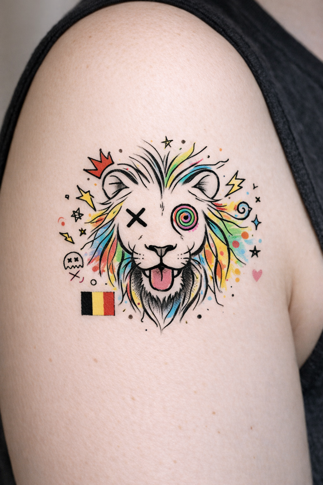

# Portfolio IA/Contenu - Coni, Wallonie 

Spécialiste freelance : Rédaction SEO, graphiques IA rapides (24h, facturation Smart). 1er gig gratuit pour 5★ review !

## Exemples
- [Tendances tatouages 2026 BE](tendances-tatouages-2026.md) (500 mots SEO)
- [Contenu IA pour PME Wallonie](Contenu-ia-pour-PME-Wallonie.md)

## Graphismes
![Tattoo Lion]
  <!-- HTML resize -->

## Skills
- IA ChatGPT/Claude (articles SEO).
- Canva/Midjourney (graphiques tattoos/PME).
- SEO Belgique (Wallonie).

Contact : [LinkedIn/DM] - BE/FR/NL. Studio tattoo Ellezelles.

